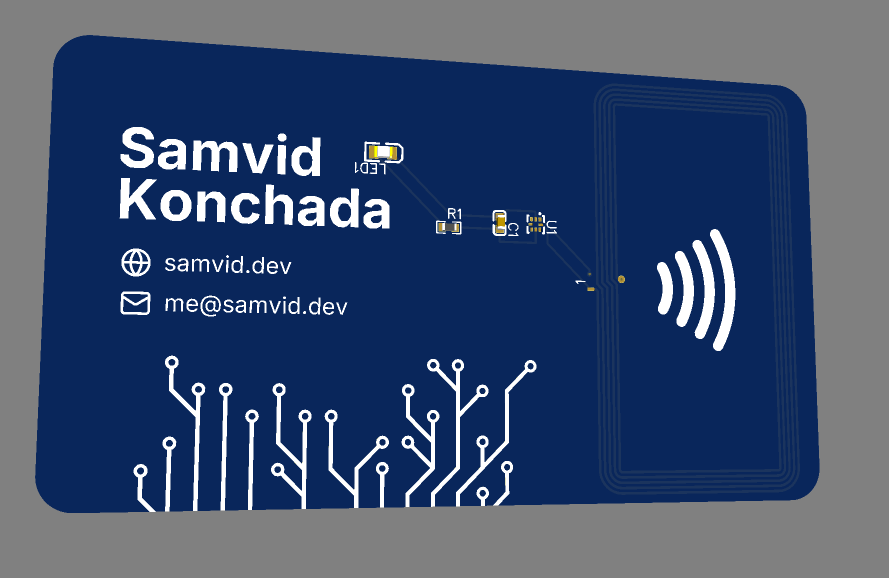
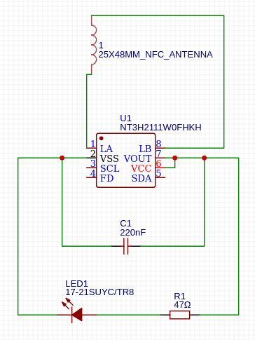

# August 4th: Made my PCB Design

- Learned how to use EasyEDA by watching a Youtube tutorial
- Read through the Hacker Card jam and replicated it on EasyEDA
- Customized the design, adding in some icons, a custom font, and a custom design
- Configured the custom design to appear gold/silver in the final PCB
- Generated export files, uploaded to JLCPCB to generate the estimate, and setup project structure for submission.

**Total time spent: 3h**
